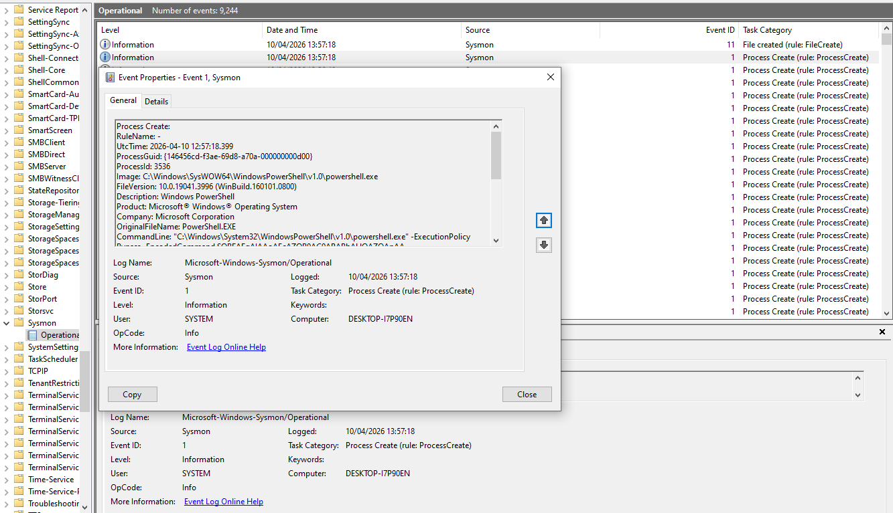
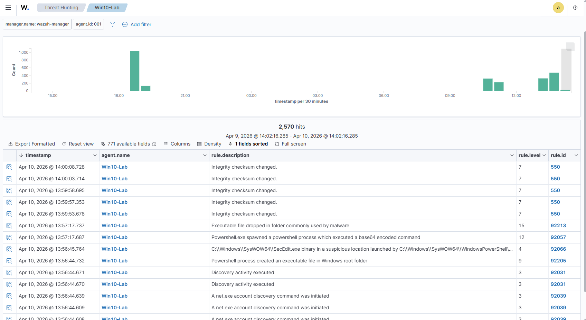

# Case Study 01 — Suspicious PowerShell Execution (T1059.001)

## Scenario
PowerShell is one of the most abused tools in modern attacks. Adversaries use it
for download cradles, encoded execution, and living-off-the-land techniques.
This simulation tests whether Wazuh and Sysmon can detect suspicious PowerShell
activity that mimics real attacker behaviour.

## Environment
- Wazuh SIEM on Ubuntu 24.04
- Windows 10 endpoint with Sysmon (SwiftOnSecurity config)
- Detection rule: Rule ID 92057 — PowerShell spawned a process executing a Base64 encoded command (Level 12)

## Attack Simulation
The following command was executed to simulate malicious PowerShell behaviour:

powershell.exe -ExecutionPolicy Bypass -EncodedCommand <base64-string>

### Why this matters
- ExecutionPolicy Bypass ignores security restrictions  
- EncodedCommand hides the real payload  
- Attackers use this pattern for initial access, persistence, and C2 activity  

## Detection

- **Detection rule:** Powershell.exe spawned a powershell process which executed a base64 encoded command  
- **Wazuh alert level:** 12  
- **Triggered rule ID:** 92057  
- **Additional related alerts:**  
  - Executable file dropped in folder commonly used by malware (Level 15, Rule ID 92213)  
  - Discovery activity via `net.exe` (Level 3, Rule ID 92039)  
  - Suspicious file creation in Windows root folder (Level 9, Rule ID 92205)

## Investigation Walkthrough

1. **Parent process:** powershell.exe was spawned by another PowerShell process:
   `C:\Windows\SysWOW64\WindowsPowerShell\v1.0\powershell.exe`.  
   PowerShell spawning PowerShell is uncommon and often associated with obfuscation or staged execution.

2. **Decoded the Base64 payload:**  
   The encoded command (`SQBFAFgAIAAoAEcAZQB0AC0ARABhAHQAZQApAA==`) decoded to:  
   `Invoke-Expression (Get-Date)` — a simple test payload used to validate encoded execution.

3. **Network connections (Sysmon Event ID 3):**  
   No network connections were logged. This is expected because the decoded payload did not perform any outbound communication.

4. **File writes (Sysmon Event ID 11):**  
   Wazuh raised Rule 92213 — an executable was dropped in a folder commonly used by malware. This supports the malicious activity pattern.

5. **Discovery activity:**  
   Wazuh detected `net.exe` enumeration (Rule 92039), indicating the attacker attempted account discovery after execution.

6. **Escalation decision:**  
   The combination of encoded PowerShell execution, suspicious parent-child process behavior, file drop, and discovery activity indicates a likely compromise. This would be escalated as **High severity**.

1. **Parent process:** powershell.exe was spawned by **<insert parent process here — e.g., explorer.exe or cmd.exe>**.
2. **Decoded the Base64 payload:** The encoded command decoded to: **<insert decoded payload summary here>**.
3. **Network connections (Sysmon Event ID 3):** **<state whether Sysmon logged any outbound connections — if none, write “No network connections were logged.”>**
4. **File writes (Sysmon Event ID 11):** Wazuh raised Rule 92213 — an executable was dropped in a folder commonly used by malware. This supports the malicious activity.
5. **Discovery activity:** Wazuh detected `net.exe` enumeration (Rule 92039), indicating the attacker attempted account discovery.
6. **Escalation decision:** The combination of encoded PowerShell execution, file drop, and discovery activity indicates a likely compromise. This would be escalated as **High severity**.

## MITRE ATT&CK Mapping
- Tactic: Execution
- Technique: T1059.001 — PowerShell
- Relevance: Common in initial access, lateral movement, and C2 communication

## Outcome

Wazuh successfully detected the simulated encoded PowerShell activity on the Win10-Lab endpoint. The key alert was:

- **Rule description:** Powershell.exe spawned a powershell process which executed a base64 encoded command  
- **Rule level:** 12  
- **Rule ID:** 92057  

In addition to that, Wazuh also raised related alerts for an executable file dropped in a folder commonly used by malware (Level 15, Rule ID 92213) and discovery activity such as `net.exe` account enumeration. Together, these events show that the Sysmon → Wazuh pipeline is working as intended and that this lab can reliably detect suspicious PowerShell execution and early-stage attacker behaviour.

## Screenshots

### Sysmon Event ID 1 – Process Creation

### Wazuh Detection – Encoded PowerShell Command

## Outcome

Wazuh successfully detected the simulated encoded PowerShell activity on the Win10-Lab endpoint. The key alert was:

- **Rule description:** Powershell.exe spawned a powershell process which executed a base64 encoded command  
- **Rule level:** 12  
- **Rule ID:** 92057  

In addition to that, Wazuh also raised related alerts for an executable file dropped in a folder commonly used by malware (Level 15, Rule ID 92213) and discovery activity such as `net.exe` account enumeration. Together, these events show that the Sysmon → Wazuh pipeline is working as intended and that this lab can reliably detect suspicious PowerShell execution and early-stage attacker behaviour.

## Screenshots
## Sysmon Event ID 1 – Process Creation

## Wazuh Detection – Encoded PowerShell Command

